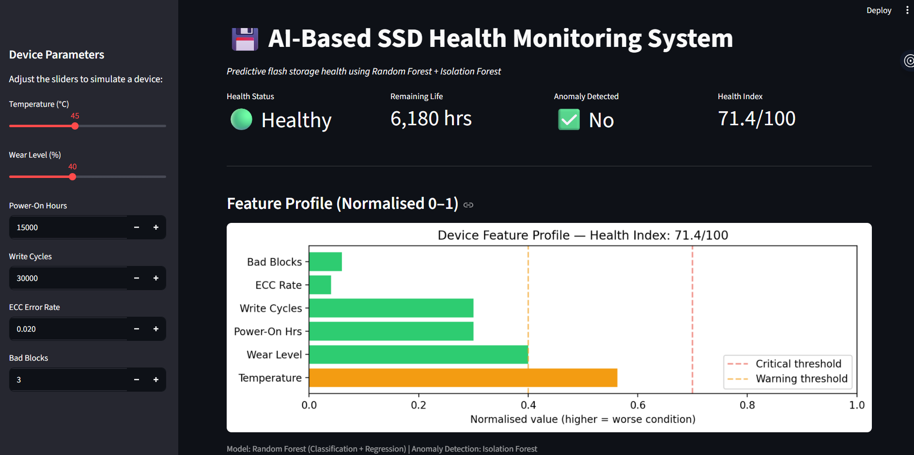

# 💾 # AI-Based SSD Health Monitoring System

Predictive SSD health monitoring using Machine Learning techniques for health classification, remaining useful life (RUL) estimation, and anomaly detection.

## Dashboard Preview



## Features

- SSD Health Classification (Healthy / Warning / Critical)
- Remaining Useful Life (RUL) Prediction
- Anomaly Detection using Isolation Forest
- Composite Health Index (0–100)
- Interactive Streamlit Dashboard

## Tech Stack

- Python
- Pandas
- NumPy
- Scikit-Learn
- Matplotlib
- Streamlit

## Machine Learning Models

- Random Forest Classifier
- Random Forest Regressor
- Isolation Forest

## Project Structure

```text
data/        - Dataset and processed files
models/      - Trained ML models
notebooks/   - EDA, preprocessing and model development
reports/     - Visualizations and evaluation results
scripts/     - Verification and testing scripts
dashboard/   - Streamlit dashboard
```
